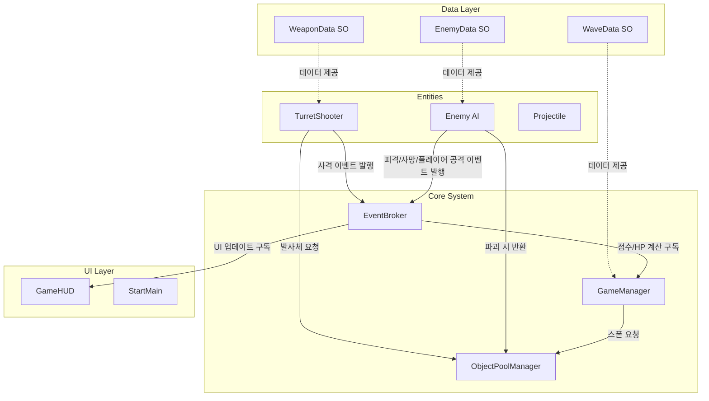

# 🎮 POTOP 상세 기획서 (Vibe Coding 최적화)

본 기획서는 LLM 기반의 바이브 코딩(Vibe Coding)을 위해 작성된 상세 설계 문서입니다. 향후 진행될 Phase 2(게임 확장) 및 Phase 3(폴리싱) 개발과 기존 아키텍처의 한계를 극복하기 위한 리팩토링 설계를 포함하고 있습니다.

---

## 1. 프로젝트 개요 및 목표

*   **프로젝트명**: POTOP
*   **장르**: 1인칭 터렛 디펜스 / 아케이드 슈터 (고정 위치 360도 방어)
*   **기술 스택**: Unity 6000.0.73f1, C#, URP, New Input System
*   **현재 상태**: Phase 1 MVP 완료 (핵심 게임 루프, UI, 씬 전환, 기본 터렛 및 적 기능 구현 완료)
*   **핵심 목표 (Phase 2 & 리팩토링)**:
    1.  **아키텍처 고도화**: 직접 참조 제거, 결합도 완화, 성능 최적화 (이벤트 시스템, 오브젝트 풀링, ScriptableObject 도입)
    2.  **컨텐츠 확장**: 웨이브 기반 난이도 조절, 적 다양화, 무기 시스템 도입

---

## 2. 시스템 아키텍처 다이어그램 (개선된 구조)

기존 스크립트 간 직접 참조 구조에서 **이벤트 브로커(Event Broker)** 와 **오브젝트 풀(Object Pool)** 을 중심으로 느슨하게 결합된(Loosely Coupled) 아키텍처로 개편합니다.

---

## 3. 핵심 기능 명세 및 개선 방안

### 3.1 코어 아키텍처 개편 (리팩토링)
1.  **이벤트 기반 통신 (Event-Driven Architecture)**
    *   `GameManager`, `GameHUD`, `Enemy` 등 간의 직접 참조(GetComponent 등)를 제거합니다.
    *   C# `event` 또는 `Action`을 활용한 정적 이벤트 매니저 클래스(혹은 ScriptableObject 기반 이벤트)를 도입합니다.
    *   *주요 이벤트*: `OnEnemyKilled`, `OnPlayerTakeDamage`, `OnScoreChanged`, `OnWaveStarted`.
2.  **오브젝트 풀링 (Object Pooling)**
    *   적(`Enemy`)과 발사체(`Projectile`) 생성/파괴 시 발생하는 GC(가비지 컬렉션) 오버헤드를 방지합니다.
    *   `UnityEngine.Pool` API를 적극 활용하여 풀링 매니저를 구현합니다.
3.  **데이터 주도 설계 (ScriptableObject)**
    *   적의 HP, 속도, 모델 프리팹이나 무기의 연사력, 공격력 등을 하드코딩하지 않고 ScriptableObject(`SO`)로 분리합니다.

### 3.2 게임 확장 기능 (Phase 2)
1.  **웨이브 시스템 (Wave System)**
    *   시간 경과 또는 킬 수에 따라 웨이브(Wave)가 상승합니다.
    *   웨이브가 올라갈수록 적 스폰 주기 감소, 엘리트 적 스폰 확률 증가 등의 난이도 스케일링이 적용됩니다.
2.  **적 다양화 (Enemy Variations)**
    *   **기본형(Basic)**: 중간 속도, 낮은 HP.
    *   **고속형(Runner)**: 빠른 속도, 매우 낮은 HP.
    *   **탱커형(Tank)**: 느린 속도, 높은 HP, 큰 크기.
3.  **무기 시스템 (Weapon System)**
    *   인터페이스(`IWeapon`) 기반으로 무기를 추상화하여 확장성을 확보합니다.
    *   **기본 단발포**: 현재 구현된 기본 무기.
    *   **샷건 / 3점사 / 레이저** 등 다양한 공격 패턴을 가진 무기를 쉽게 추가할 수 있도록 구조를 잡습니다.

---

## 4. 데이터 모델 스키마 (Scriptable Objects)

데이터 구조의 설계를 명확히 하기 위해 주요 ScriptableObject의 스키마를 정의합니다.

### 4.1 EnemyData (적 데이터 스키마)
*   `EnemyID` (string): 고유 식별자 (예: "enemy_runner")
*   `EnemyName` (string): 표시 이름
*   `Prefab` (GameObject): 적 시각적 모델 및 로직이 포함된 프리팹
*   `MaxHealth` (float): 최대 체력
*   `MoveSpeed` (float): 이동 속도
*   `DamageAmount` (int): 플레이어 도달 시 입히는 피해량
*   `ScoreValue` (int): 처치 시 획득 점수

### 4.2 WeaponData (무기 데이터 스키마)
*   `WeaponID` (string): 고유 식별자 (예: "weapon_shotgun")
*   `WeaponName` (string): 무기 이름
*   `FireRate` (float): 연사 간격 (초 단위)
*   `Damage` (int): 1발당 데미지
*   `ProjectileSpeed` (float): 발사체 이동 속도
*   `ProjectilePrefab` (GameObject): 이 무기가 사용하는 발사체 프리팹

### 4.3 WaveData (웨이브 관리 스키마)
*   `WaveNumber` (int): 웨이브 단계 번호
*   `SpawnInterval` (float): 기본 스폰 간격
*   `AllowedEnemyTypes` (List<EnemyData>): 해당 웨이브에서 스폰 가능한 적 타입 리스트
*   `EnemiesToKill` (int): 다음 웨이브로 넘어가기 위한 목표 킬 수

---

본 상세 기획서는 Vibe Coding을 위한 참조 문서이며, 마일스톤 설계에 따라 모듈 단위로 분리되어 점진적으로 구현될 것입니다.
