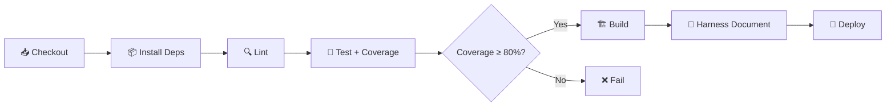

# Software Configuration Specification (SCS)

> **Document ID**: SCS-potop-001
> **Version**: 0.1.0 (Draft)
> **Last Updated**: 2026-05-20
> **Author**: Harness Protocol
> **Status**: Draft | In Review | Approved | Superseded

---

## Quick Start

1. Fill the Environment Matrix (Section 2) first — it defines all target environments
2. Never commit secrets to this document — use references to secret stores only
3. Every configuration key must have a default value and validation rule
4. Reference this document from [SDD](../specs/SDD.md) for deployment-specific design decisions

---

## Table of Contents

1. [Overview](#1-overview)
2. [Environment Matrix](#2-environment-matrix)
3. [Configuration Parameters](#3-configuration-parameters)
4. [Dependency Versions & Lock Policy](#4-dependency-versions--lock-policy)
5. [Build Configuration](#5-build-configuration)
6. [Secret Management](#6-secret-management)
7. [CI/CD Pipeline Configuration](#7-cicd-pipeline-configuration)
8. [Infrastructure as Code](#8-infrastructure-as-code)
9. [Rollback Procedures](#9-rollback-procedures)
10. [Feature Flags](#10-feature-flags)
11. [Monitoring & Alerting Configuration](#11-monitoring--alerting-configuration)
12. [Revision History](#12-revision-history)
13. [Related Documents](#13-related-documents)

---

## 1. Overview

### 1.1 Purpose

This document specifies all configuration parameters, environment variables, dependency versions, build settings, and deployment configurations for **potop**.

### 1.2 Configuration Philosophy

- **Principle**: {12-Factor App / GitOps / Environment-driven}
- **Precedence Order**: CLI args > Environment variables > Config file > Defaults
- **Validation**: All configuration is validated at startup; invalid config = fail-fast

---

## 2. Environment Matrix

| Aspect | Development | Staging | Production |
|---|---|---|---|
| **Purpose** | Local development & testing | Pre-production validation | Live user-facing |
| **URL** | `http://localhost:{PORT}` | `https://staging.{DOMAIN}` | `https://{DOMAIN}` |
| **Database** | SQLite / Local PostgreSQL | Managed PostgreSQL (shared) | Managed PostgreSQL (dedicated) |
| **Log Level** | DEBUG | INFO | WARN |
| **Debug Mode** | Enabled | Enabled | **Disabled** |
| **SSL/TLS** | Self-signed / None | Let's Encrypt | CA-signed |
| **Replicas** | 1 | 1-2 | 2+ (auto-scaling) |
| **Backup Schedule** | None | Daily | Hourly incremental + daily full |
| **Access Control** | Open | Team only (VPN/IP whitelist) | Public + WAF |
| **Monitoring** | Console logs | Basic metrics | Full APM + alerts |

---

## 3. Configuration Parameters

### 3.1 Application Configuration

| Key | Type | Default | Dev | Staging | Prod | Description | Validation Rule |
|---|---|---|---|---|---|---|---|
| `APP_NAME` | string | `{project}` | same | same | same | Application identifier | Non-empty |
| `APP_PORT` | int | `3000` | `3000` | `8080` | `8080` | HTTP listen port | 1024-65535 |
| `APP_ENV` | enum | `development` | `development` | `staging` | `production` | Runtime environment | One of: development, staging, production |
| `LOG_LEVEL` | enum | `info` | `debug` | `info` | `warn` | Minimum log severity | One of: debug, info, warn, error |
| `CORS_ORIGINS` | string[] | `["*"]` | `["*"]` | `["https://staging.*"]` | `["https://{DOMAIN}"]` | Allowed CORS origins | Valid URL patterns |

### 3.2 Database Configuration

| Key | Type | Default | Dev | Staging | Prod | Validation Rule |
|---|---|---|---|---|---|---|
| `DB_HOST` | string | `localhost` | `localhost` | `{staging-host}` | `{prod-host}` | Valid hostname |
| `DB_PORT` | int | `5432` | `5432` | `5432` | `5432` | 1-65535 |
| `DB_NAME` | string | `{project}_dev` | `{project}_dev` | `{project}_staging` | `{project}_prod` | Alphanumeric + underscore |
| `DB_USER` | string | `{project}` | `{project}` | → Secret Store | → Secret Store | Non-empty |
| `DB_PASSWORD` | **SECRET** | — | `dev_password` | → Secret Store | → Secret Store | See [Section 6](#6-secret-management) |
| `DB_POOL_SIZE` | int | `10` | `5` | `10` | `50` | 1-200 |
| `DB_TIMEOUT_MS` | int | `5000` | `10000` | `5000` | `3000` | > 0 |

### 3.3 External Service Configuration

| Key | Type | Default | Description | Validation Rule |
|---|---|---|---|---|
| `{SERVICE}_API_URL` | string | — | Base URL for {service} | Valid HTTPS URL |
| `{SERVICE}_API_KEY` | **SECRET** | — | API key for {service} | See [Section 6](#6-secret-management) |
| `{SERVICE}_TIMEOUT_MS` | int | `30000` | Request timeout | > 0 |
| `{SERVICE}_RETRY_COUNT` | int | `3` | Max retry attempts | 0-10 |

---

## 4. Dependency Versions & Lock Policy

### 4.1 Runtime Dependencies

| Package | Pinned Version | Min Supported | Update Policy | Notes |
|---|---|---|---|---|
| `{runtime}` | `{20.11.0}` | `{20.x}` | LTS only | Managed via `.tool-versions` / `Dockerfile` |
| `{framework}` | `{^4.18.2}` | `{4.x}` | Minor auto-update | Lock file enforced |

### 4.2 Dev Dependencies

| Package | Pinned Version | Purpose |
|---|---|---|
| `{test_runner}` | `{^29.7.0}` | Unit/integration testing |
| `{coverage_tool}` | `{^8.0.1}` | LCOV coverage for Harness (≥ 80% required) |
| `{linter}` | `{^3.0.0}` | Code style enforcement |

### 4.3 Lock File Policy

- **Lock file**: `{package-lock.json / yarn.lock / poetry.lock / go.sum}`
- **Commit to VCS**: **Yes** (always)
- **CI validation**: `npm ci` / `pip install --require-hashes` (exact reproduction)
- **Update cadence**: Security patches within 48h, minor versions monthly, major versions require ADR

---

## 5. Build Configuration

### 5.1 Build Targets

| Target | Command | Output | Notes |
|---|---|---|---|
| Development | `{npm run dev / make dev}` | Hot-reload server | Source maps enabled |
| Test | `{npm test / make test}` | Test results + LCOV | Harness integration: `c8 node --test` |
| Production | `{npm run build / make build}` | Optimized bundle | Minified, no source maps |
| Docker | `docker build -t {image}:{tag} .` | Container image | Multi-stage build |

### 5.2 Build Environment Variables

| Variable | Purpose | Required At |
|---|---|---|
| `NODE_ENV` | Build optimization level | Build time |
| `BUILD_VERSION` | Semantic version tag | Build time |
| `COMMIT_SHA` | Git commit hash for traceability | Build time |

---

## 6. Secret Management

> **CRITICAL**: No secrets are stored in this document, source code, or version control.

### 6.1 Secret Storage Strategy

| Environment | Strategy | Tool | Access Control |
|---|---|---|---|
| Development | `.env` file (gitignored) | `dotenv` | Developer-local only |
| Staging | Cloud secret manager | {AWS Secrets Manager / GCP Secret Manager / Vault} | IAM role-based |
| Production | Cloud secret manager + rotation | {AWS Secrets Manager / GCP Secret Manager / Vault} | Strict IAM + audit log |

### 6.2 Secret Inventory

| Secret Name | Environment(s) | Rotation Policy | Owner | Last Rotated |
|---|---|---|---|---|
| `DB_PASSWORD` | Staging, Production | Every 90 days | {Ops team} | 2026-05-20 |
| `{SERVICE}_API_KEY` | All | On compromise or annually | {Service owner} | 2026-05-20 |
| `JWT_SECRET` | Staging, Production | Every 30 days | {Auth team} | 2026-05-20 |

### 6.3 `.env.example` Template

```env
# Copy to .env and fill in values — NEVER commit .env to version control
APP_PORT=3000
APP_ENV=development
DB_HOST=localhost
DB_PORT=5432
DB_NAME={project}_dev
DB_USER={project}
DB_PASSWORD=CHANGE_ME
```

---

## 7. CI/CD Pipeline Configuration

### 7.1 Pipeline Stages



### 7.2 Pipeline Configuration

| Stage | Command | Timeout | Failure Action |
|---|---|---|---|
| Install | `{npm ci}` | 5 min | Fail pipeline |
| Lint | `{npm run lint}` | 2 min | Fail pipeline |
| Test | `{harness.sh test --id CI --cmd "c8 npm test"}` | 10 min | Fail pipeline |
| Build | `{npm run build}` | 5 min | Fail pipeline |
| Deploy (Staging) | `{deploy script}` | 10 min | Rollback |
| Deploy (Prod) | `{deploy script}` | 10 min | Rollback |

### 7.3 Branch Strategy

| Branch | Purpose | Deploy Target | Protection Rules |
|---|---|---|---|
| `main` | Production-ready code | Production | Require PR + 1 approval + CI pass |
| `develop` | Integration branch | Staging | Require CI pass |
| `feature/*` | Feature development | — | — |
| `hotfix/*` | Emergency fixes | Production (fast-track) | Require 1 approval |

---

## 8. Infrastructure as Code

### 8.1 IaC Tool

- **Tool**: {Terraform / Pulumi / CloudFormation / Docker Compose}
- **State Storage**: {S3 + DynamoDB / GCS / Local}
- **Modules Location**: `{infra/ / terraform/ / deploy/}`

### 8.2 Resource Inventory

| Resource | Provider | Dev | Staging | Production |
|---|---|---|---|---|
| Compute | {EC2 / Cloud Run / ECS} | {t3.micro} | {t3.small} | {t3.medium x2} |
| Database | {RDS / Cloud SQL} | {Local} | {db.t3.micro} | {db.t3.medium} |
| Storage | {S3 / GCS} | {Local fs} | {Standard} | {Standard + Versioning} |

---

## 9. Rollback Procedures

### 9.1 Application Rollback

| Step | Action | Command | Estimated Time |
|---|---|---|---|
| 1 | Identify failing version | Check monitoring dashboard | 1 min |
| 2 | Rollback deployment | `{kubectl rollout undo / deploy --version PREV}` | 2 min |
| 3 | Verify health | Check health endpoint + key metrics | 2 min |
| 4 | Notify stakeholders | Post in {#incidents channel} | 1 min |

### 9.2 Database Rollback

| Scenario | Strategy | Risk Level | RTO |
|---|---|---|---|
| Schema migration failure | Reverse migration script | Medium | 5-15 min |
| Data corruption | Point-in-time restore from backup | High | 15-60 min |

### 9.3 Safe Database Testing Policy

> **MANDATORY**: All migration scripts and database test operations MUST comply with this policy.

#### 9.3.1 Prohibited Destructive Commands

The following SQL commands are **STRICTLY FORBIDDEN** in auto-generated migrations and agent-created scripts:

| Prohibited Command | Reason | Safe Alternative |
|---|---|---|
| `DROP TABLE` | Irreversible data loss | `ALTER TABLE ... RENAME TO ..._deprecated` |
| `DROP DATABASE` | Catastrophic data loss | Never auto-generate |
| `TRUNCATE TABLE` | Bypasses triggers, no rollback | `DELETE FROM ... WHERE {condition}` |
| `DELETE FROM {table}` (no WHERE) | Unguarded mass deletion | Always include `WHERE` clause |
| `DROP COLUMN` | Silent data loss | Add new column, migrate data, deprecate old |

> **Enforcement**: CI pipelines MUST scan migration files for prohibited patterns before execution. Harness agents are FORBIDDEN from generating these commands.

#### 9.3.2 Memory Database Sandbox (Mandatory for Tests)

| Environment | Database | Configuration |
|---|---|---|
| Unit Tests | SQLite `:memory:` or H2 in-memory | `DB_HOST=:memory:` |
| Integration Tests | Isolated container DB (ephemeral) | Docker-based, destroyed after test |
| Staging | Managed DB with test data subset | Seeded via fixtures, never production data |
| Production | **NEVER** used for testing | Read-only access for monitoring only |

**Agent Rule**: When an AI agent generates migration scripts, it MUST:
1. Test the migration against a memory DB sandbox first
2. Include a reverse migration (rollback) script
3. Never emit `DROP`, `TRUNCATE`, or unguarded `DELETE`
4. Log the migration diff in the cycle log before execution

---

## 10. Feature Flags

| Flag Name | Type | Default | Environments Active | Owner | Expiry |
|---|---|---|---|---|---|
| `{FEATURE_NEW_UI}` | boolean | `false` | Staging, Prod (10% rollout) | {Team} | 2026-05-20 |
| `{FEATURE_V2_API}` | boolean | `false` | Dev, Staging | {Team} | 2026-05-20 |

---

## 11. Monitoring & Alerting Configuration

| Metric | Warning Threshold | Critical Threshold | Alert Channel | Runbook |
|---|---|---|---|---|
| Error rate (5xx) | > 1% | > 5% | {PagerDuty / Slack} | {Link} |
| Response time (p95) | > 500ms | > 2000ms | {Slack} | {Link} |
| CPU utilization | > 70% | > 90% | {Auto-scale + Slack} | {Link} |
| Disk usage | > 70% | > 90% | {PagerDuty} | {Link} |

---

## 12. Revision History

| Version | Date | Author | Description |
|---|---|---|---|
| 0.1.0 | 2026-05-20 | Harness Protocol | Initial draft |

---

## 13. Related Documents

| Document | Path | Relationship |
|---|---|---|
| Software Design Document | `docs/specs/SDD.md` | Architecture this config supports |
| Software Requirements Specification | `docs/specs/SRS.md` | NFRs driving config decisions |
| Troubleshooting Log | `docs/troubleshooting/TROUBLESHOOTING.md` | Config-related incident history |
