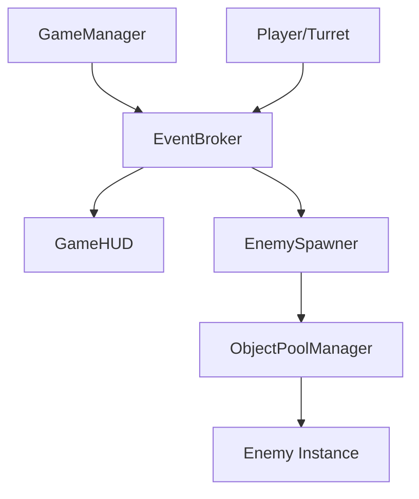

## **4-9. 기술 구현 상세 (Technical Implementation)**

### **🏗️ 아키텍처 비전 (Phase 2)**
기존의 강한 결합을 해소하고, 대규모 물량 처리를 위한 성능 최적화를 최우선으로 합니다.

#### **1. 이벤트 브로커 (Event Broker)**
*   **구조:** `Action<T>` 기반의 중앙 이벤트 버스 구현.
*   **적용:** 
    *   `Enemy.OnDestroyed` -> `GameManager.AddScore`, `GameHUD.UpdateUI`
    *   `Player.OnLevelUp` -> `UI_LevelUpSelection.Open`
*   **이점:** 각 클래스가 서로의 존재를 몰라도 이벤트를 주고받을 수 있어 유지보수성 향상.

#### **2. 오브젝트 풀링 (Object Pooling)**
*   **대상:** 투사체(Projectile), 적(Enemy), 경험치 보석(EXP Gem), 이펙트(VFX).
*   **도구:** Unity 6 `UnityEngine.Pool` API 활용.
*   **목표:** 런타임 중 `Instantiate`/`Destroy` 호출을 0으로 수렴시켜 가비지 컬렉션(GC) 부하 최소화.

#### **3. 데이터 관리 (Data Management)**
*   **ScriptableObjects (SO):** 
    *   `TurretData`: 공격력, 연사력 등 기본 스탯.
    *   `EnemyData`: 적 유형별 체력, 속도, 드랍 경험치량.
    *   `WaveData`: 시간대별 스폰 규칙 및 난이도 가중치.
*   **데이터 흐름:** `GameManager`가 현재 웨이브 SO를 읽어 `EnemySpawner`에 명령을 내리는 방식.

### **🗺️ 클래스 관계도 (Core Logic)**

### **🛠️ 주요 최적화 기술**
*   **SIMD 활용:** 수백 개의 적이 플레이어를 향하는 연산에 활용 검토.
*   **UI Toolkit:** 기존 uGUI 대신 성능이 뛰어나고 스타일시트 관리가 용이한 UI Toolkit 적용.
