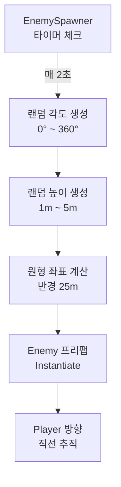

## **4\. 주요 기능 및 게임 시스템 (Key Features)**

### **🕹️ 4-1. 코어 게임 플레이**

* **기본 구조:** 플레이어는 게임 시작 전 **서로 다른 기본 투사체와 특성을 가진 포탑 중 하나를 선택**하여, 화면 중앙의 고정된 위치에서 조작합니다.  
* **상세 조작 방식 (Controls):**  
  * **모바일 (Mobile):**  
    * 포탑 회전: 가상 조이스틱(Virtual Joystick) 또는 기기 기울기(자이로/가속도 센서)를 활용한 물리적 회전 지원 (유저 옵션 선택 가능).  
    * 투사체 발사: 화면 우측 하단에 위치한 전용 발사 버튼 터치.  
  * **PC 및 콘솔 (PC/Console):**  
    * 포탑 회전: 키보드(WASD 또는 방향키), 마우스(마우스 이동으로 조준), 게임 패드(L-Stick).  
    * 투사체 발사: 키보드(Space bar 또는 Enter), 마우스(좌클릭), 게임 패드(RT/R2 트리거).  
    * 커스터마이징: 키보드 플레이어의 편의를 위해 **자유로운 키 할당(Key Binding)** 기능 제공.  
  * **VR (Virtual Reality):**  
    * 포탑 회전: HMD 시선 추적(Gaze, 고개를 돌려 화면 중앙으로 조준) 또는 VR 모션 컨트롤러를 통한 레이캐스트 조준 (유저 편의에 따라 옵션 제공).  
    * 투사체 발사: VR 컨트롤러의 후면 트리거 버튼(Index Trigger) 클릭 및 유지.  
* **승패 조건:** 사방에서 날아오는 오브젝트를 파괴하여 점수를 얻고, 방어 실패 시 체력이 감소하여 0이 되면 게임 오버됩니다.  
* **로그라이트 성장 (웨이브 시스템):** 경험치를 모아 레벨업을 하거나 웨이브 클리어 시 무작위 강화 선택지가 주어지며 자신만의 빌드를 구축합니다.

### **🔥 4-2. 플레이어 포탑 & 적 오브젝트 시스템**

* **시작 포탑 클래스 (Selectable Turrets):**  
  플레이어는 로비에서 각기 다른 특성을 가진 포탑을 선택할 수 있으며, 포탑에 따라 초반 운영과 후반 시너지 조합이 달라집니다.  
  1. **가디언 (Guardian):** 밸런스형. 직선 탄환 발사.  
  2. **발키리 (Valkyrie):** 연사형. 저데미지 고속 기관총 난사.  
  3. **저거너트 (Juggernaut):** 한방형. 고데미지 저속 관통 철갑탄.  
  4. **노바 (Nova):** 유틸형. 스플래시 데미지를 주는 에너지 구체.  
* **적 오브젝트 다각화 (세부 기믹 및 외형):**  
  1. **스카우터 (기본형):** 직선으로 이동. 물량으로 승부.  
  2. **블리츠 미사일 (암살자형):** 2.5배 빠른 속도. 지그재그 회피 기동.  
  3. **아머드 메테오 (탱커형):** 속도 느림. 높은 체력과 **넉백(Knock-back) 저항** 보유.  
  4. **스웜 포드 (분열형):** 파괴 시 3\~5개의 작고 빠른 '마이크로 봇'으로 분열되어 돌진.  
  5. **헬파이어 (자폭형):** 포탑 주변 일정 거리에서 멈춘 뒤, 1.5초 후 치명적인 자폭 광역 피해 발생.  
  6. **타이탄 코어 (15분 최종 보스):** 거대한 기하학적 본체. 회전 쉴드 링 전개 및 십자 레이저 패턴 발사.

### **🌟 4-3. 레벨업 능력 및 투사체 진화 상세 (Ability Tiers & Stats)**

모든 능력은 \*\*최대 5레벨(Max Lv.5)\*\*까지 강화 가능합니다. 레벨업 시 3개의 무작위 선택지가 등장하며, 각 단계별 수치는 다음과 같습니다.

#### **\[기본 스탯 강화 (Passive Abilities)\]**

| 능력명 | Lv.1 | Lv.2 | Lv.3 | Lv.4 | Lv.5 (Max) |
| :---- | :---- | :---- | :---- | :---- | :---- |
| **공격력 증가** | 데미지 \+20% | 데미지 \+40% | 데미지 \+60% | 데미지 \+80% | **데미지 \+100% (2배)** |
| **공격 속도 증가** | 발사 딜레이 \-10% | 딜레이 \-20% | 딜레이 \-30% | 딜레이 \-40% | **딜레이 \-50% (연사 2배)** |
| **치명타 강화** | 확률 \+10% | 확률 \+20% | 확률 \+30% | 확률 \+40% | **확률 \+50% / 피해량 2배** |
| **투사체 속도** | 속도 \+15% | 속도 \+30% | 속도 \+45% | 속도 \+60% | **속도 \+75% / 넉백 \+20%** |
| **자력 반경 확장** | 반경 \+30% | 반경 \+60% | 반경 \+90% | 반경 \+120% | **반경 \+150% (화면 1/3 커버)** |

#### **\[투사체 성질 변화 (Active Mutations)\]**

| 능력명 | Lv.1 | Lv.2 | Lv.3 | Lv.4 | Lv.5 (Max) |
| :---- | :---- | :---- | :---- | :---- | :---- |
| **다연발** | 탄 수 \+1발 | 탄 수 \+2발 | 탄 수 \+3발 | 탄 수 \+4발 | **360도 전방위 8발 발사** |
| **관통** | 관통 횟수 1회 | 관통 횟수 2회 | 관통 횟수 3회 | 관통 횟수 5회 | **무한 관통 (화면 끝까지)** |
| **도탄/반사** | 도탄 1회 | 도탄 2회 | 도탄 3회 | 도탄 4회 | **도탄 5회 / 적중시 데미지 x1.5** |
| **폭발탄** | 반경 1m 폭발 | 반경 1.5m | 반경 2m | 반경 2.5m | **폭발 시 3개 유도 폭탄 분열** |
| **거대화** | 크기 1.5배 | 크기 2배 | 크기 2.5배 | 크기 3배 | **크기 5배 / 일반 적 즉사 판정** |

#### **\[궁극 진화 (Weapon Evolution)\]**

두 가지 핵심 능력(액티브+패시브)이 모두 Lv.5에 도달하면 보스 상자에서 **궁극의 형태**로 진화합니다.

* **\[오비탈 스트라이크\]**: 폭발탄 Lv.5 \+ 거대화 Lv.5  
  * *효과:* 투사체가 사라지고, 조준 지점에 화면 절반을 뒤덮는 궤도 폭격 포탄이 낙하하여 모든 적 초토화.  
* **\[프리즘 체인\]**: 다연발 Lv.5 \+ 도탄 Lv.5  
  * *효과:* 포탑에서 실시간으로 연결되는 레이저가 발사되어, 화면 내 모든 적을 0.1초 만에 튕기며 전멸시킴.  
* **\[개틀링 레일건\]**: 관통 Lv.5 \+ 공격 속도 Lv.5  
  * *효과:* 발사 딜레이가 0이 되며, 마우스가 가리키는 방향으로 모든 적을 뚫어버리는 무한 레이저 탄막 형성.

### **⚡ 4-4. 액티브 전술 스킬 (Tactical Skills)**

* **에너지 시스템:** 적 파괴 시 스킬 에너지 충전. 100% 도달 시 발동.  
* **스킬 종류:**  
  * **EMP:** 5초간 화면 모든 적 정지 및 투사체 소멸.  
  * **궤도 폭격 (Bombardment):** 화면 전체 무작위 광역 데미지 10회.  
  * **과부하 보호막 (Overload Shield):** 10초간 무적 및 충돌한 적 즉시 파괴.

### **🎁 4-5. 경험치 보석 및 필드 드랍 아이템 (EXP Gems & Field Drops)**

* **경험치 보석 (EXP Gems):**  
  * 획득 방식 1 (기본 자력): 포탑 주변 자력 반경 내 보석 자동 흡수.  
  * 획득 방식 2 (투사체 타격): 자력 반경 밖의 보석을 쏘면 즉시 포탑으로 자석처럼 날아옴.  
  * 주의: **자동 회수 시스템 없음.** 능동적으로 사격하여 파밍해야 함.  
* **특수 아이템 (Field Drops):**  
  * **초강력 자석 (Magnet):** 화면 내 모든 보석 즉시 흡수.  
  * **수리 키트 (Repair Kit):** 포탑 체력 **30(고정 수치)** 즉시 회복.  
  * **스마트 폭탄 (Smart Bomb):** 화면 내 모든 적 소멸 및 경험치 환산.  
  * **광폭화 코어 (Fever Core):** 5초간 발사 딜레이 0 (무한 연사).

### **🔥 4-6. 콤보 및 피버 시스템 (Combo & Score System)**

* **콤보 게이지:** 2초 내 연속 처치 시 누적. 10 콤보당 점수 획득 0.1배 증가.  
* **피버 타임:** 일정 콤보 이상 시 효과음 피치 상승 및 화려한 네온 트레일 이펙트 추가.

### **📊 4-7. 게임 밸런스 및 수치 기획 (Balance & Stats)**

* **포탑 초기 밸런스 테이블 (Lv.1 기준):**  
  * 가디언: 공격력 10 / 공속 0.5s / 관통 0  
  * 발키리: 공격력 4 / 공속 0.15s / 탄퍼짐 15도  
  * 저거너트: 공격력 35 / 공속 1.5s / 기본 관통 1회  
  * 노바: 공격력 15 / 공속 1.0s / 폭발 반경 0.5m  
* **오브젝트 (적) 밸런스 (기본 스탯):**  
  * 스카우터: HP 10 / 데미지 10 / EXP 10 / 속도 보통  
  * 블리츠 미사일: HP 5 / 데미지 15 / EXP 15 / 속도 매우 빠름  
  * 아머드 메테오: HP 60 / 데미지 25 / EXP 30 / 속도 느림  
  * 스웜 포드: HP 20 / 분열봇 HP 5 / EXP 40  
  * 헬파이어: HP 30 / 자폭 데미지 40 / EXP 50

### **🌊 4-8. 상세 웨이브 타임라인 (15분 \+ 무한 모드)**

* **\[00:00 \~ 03:00\] Phase 1**: 워밍업. 스카우터 위주.  
* **\[03:00 \~ 06:00\] Phase 2**: DPS 체크. 아머드 메테오 등장. 05:00 1차 엘리트 스폰.  
* **\[06:00 \~ 10:00\] Phase 3**: 기믹 대응. 스웜 포드, 헬파이어 등장. 10:00 2차 엘리트 스폰.  
* **\[10:00 \~ 14:30\] Phase 4**: 대학살. 0.2초당 적 스폰. 궁극 진화 테스트 구간.  
* **\[14:30 \~ 15:00\] Phase 5**: 폭풍전야. 적 스폰 중지, 사이렌 울림. 마지막 보석 파밍.  
* **\[15:00\] Boss Phase**: '타이탄 코어' 등장. 격파 시 클리어.  
* **[보스 격파 이후] Phase 6**: 무한 웨이브(오버클럭). 매 분마다 적 스탯 **기하급수적 폭증**. 한계 도달까지 점수 파밍 및 랭킹 경쟁.

### **🛠️ 4-9. 구현 기술 및 클래스 구조 (Implementation Details)**

Phase 1에서 구현된 핵심 시스템 및 주요 스크립트는 다음과 같습니다.

| 기능 | 주요 스크립트 | 설명 |
|------|-----------|------|
| **게임 매니저** | `GameManager.cs` | 싱글톤 기반 HP, 점수, 게임 상태(Playing/GameOver) 관리 |
| **플레이어 조작** | `FirstPersonLook.cs`, `Player.cs` | 마우스 기반 1인칭 시점 전환 및 상하 각도 제한 (-90~+90) |
| **사격 시스템** | `TurretShooter.cs`, `Projectile.cs` | 마우스 좌클릭 발사, 발사체 물리 이동 및 충돌 처리 |
| **적 시스템** | `EnemySpawner.cs`, `Enemy.cs` | 360도 전방위 랜덤 스폰 및 플레이어 추적 로직 |
| **HUD / UI** | `GameHUD.cs`, `StartMain.cs` | HP바, 점수 표시, 크로스헤어, 게임 오버 및 시작 화면 |

#### **[적 스폰 로직 상세]**
- 스폰 반경: `25m` 원형 영역
- 스폰 높이: `1m ~ 5m` 랜덤
- 360도 전 방위 랜덤 스폰 (각도 기반)

