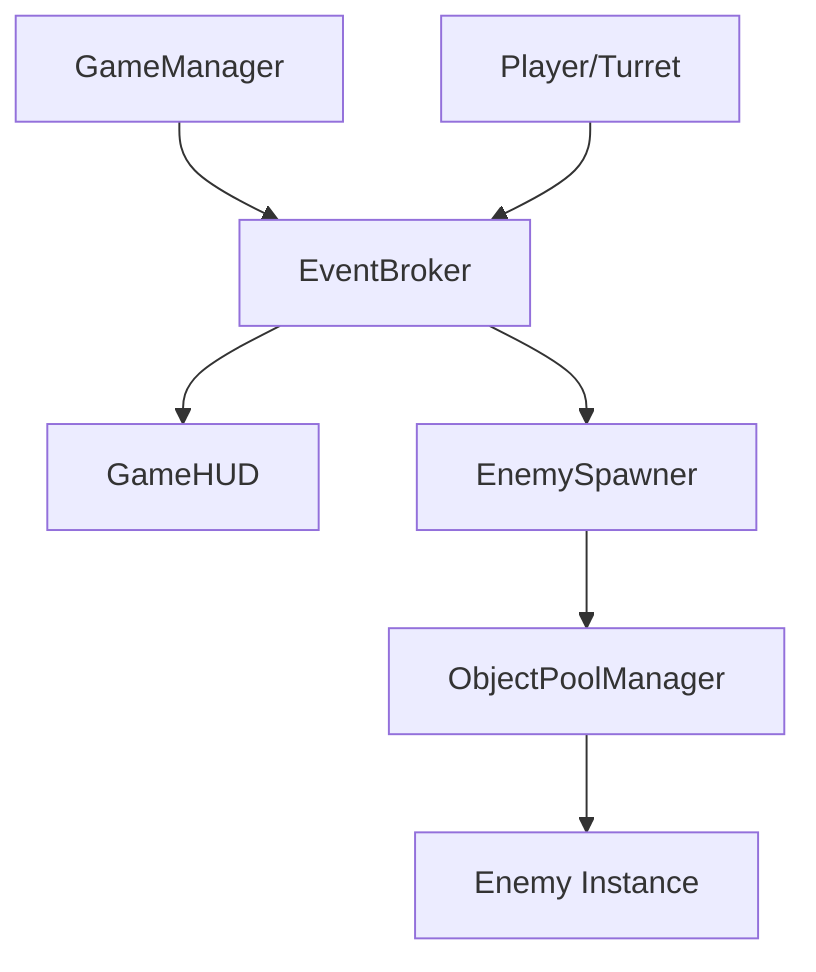

## **4. 기술 아키텍처 (Technical Architecture)**

### **🏗️ 개발 원칙 (Architecture Vision)**
POTOP은 대규모 물량(적, 투사체)을 효율적으로 처리하기 위해 **디플링(Decoupling)**과 **성능 최적화**를 핵심 설계 원칙으로 삼습니다.

---

### **🧩 주요 시스템 설계**

#### **1. 이벤트 브로커 (Event Broker)**
* **방식:** C# `Action<T>` 기반의 중앙 집중형 이벤트 버스.
* **주요 이벤트:**
  * `OnPlayerHealthChanged(int currentHP)`: 플레이어 체력 변경 시 UI 업데이트.
  * `OnEnemyKilled(EnemyData data)`: 적 처치 시 점수 합산 및 에너지 충전.
  * `OnGameStateChanged(GameState newState)`: 게임 시작/종료 처리.
* **이점:** 객체 간 직접 참조를 제거하여 코드의 독립성과 유지보수성 확보.

#### **2. 오브젝트 풀링 (Object Pooling)**
* **대상:** `Projectile`, `Enemy`, `EXPGem`, `VFX`.
* **도구:** Unity 6 내장 `UnityEngine.Pool` API 활용.
* **목표:** 런타임 중 가비지 컬렉션(GC) 발생을 최소화하여 프레임 드랍 방지.

#### **3. 데이터 주도 설계 (ScriptableObject)**
모든 게임 데이터를 코드가 아닌 `ScriptableObject` 에셋에서 관리합니다.
* `TurretData`: 공격력, 공속, 투사체 속도 등.
* `EnemyData`: HP, 속도, 경험치, 스폰 가중치.
* `WaveData`: 웨이브 지속 시간, 스폰 목록, 주기.

---

### **🛠️ 기술 스택 및 최적화**
* **Engine:** Unity 6 (6000.x)
* **Render Pipeline:** Universal Render Pipeline (URP)
* **UI System:** UI Toolkit (성능 및 스타일시트 관리 이점)
* **최적화 기법:**
  * **SIMD/Jobs:** 수백 개의 적이 플레이어를 향해 이동하는 연산에 최적화 검토.
  * **Physics Layers:** 레이어 기반 충전 행렬 최적화로 불필요한 물리 연산 제거.

---

### **🗺️ 클래스 구조도**

