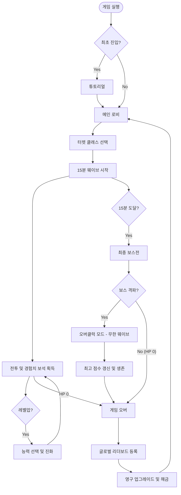

## **5. 메타 시스템 및 성장 (Meta & Progression)**

### **💰 비즈니스 모델 (Monetization)**
POTOP은 하이퍼캐주얼 장르에 최적화된 **광고 기반 수익 모델(IAA)**을 채택합니다.

* **보상형 광고 (Rewarded Ads):**
  * **부활:** 게임 오버 시 1회 한정 풀 체력으로 부활.
  * **보상 배수:** 플레이 종료 후 획득한 골드(Gem)를 2배로 획득.
  * **시작 버프:** 게임 시작 시 랜덤한 Lv.1 강화 하나를 확정 보유.
* **전면 광고 (Interstitial Ads):** 3~5판 플레이 후 로비로 복귀할 때 노출.

---

### **🏛️ 영구 강화 시스템 (Meta Progression)**
게임 플레이 중 획득한 보석(Gem)을 사용하여 터렛의 기본 성능을 영구적으로 강화합니다.

| 강화 항목 | 효과 | 레벨당 비용 (예시) |
| :--- | :--- | :--- |
| **강화 외장** | 시작 HP +10 | 500 / 1,000 / 2,000... |
| **고속 모터** | 회전 속도 +10% | 300 / 600 / 1,200... |
| **에너지 집적** | 스킬 충전 효율 +5% | 700 / 1,400 / 2,800... |
| **자력 코어** | 보석 흡수 반경 +10% | 400 / 800 / 1,600... |

---

### **🏆 경쟁 및 보상 (Leaderboard)**
* **글로벌 리더보드:** 오버클럭(무한 모드)에서 도달한 **최종 점수**를 기준으로 전 세계 유저와 경쟁합니다.
* **업적:** 특정 조건(예: 10분 생존, 보스 노히트 격파 등) 달성 시 특수 코스튬이나 이펙트 해금.

---

### **🔄 전체 게임 플로우 (Game Flow)**

