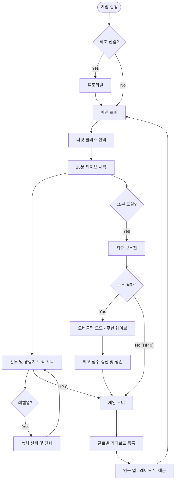

## **7. 게임 플로우 차트 (Game Flow)**

```mermaid
flowchart TD  
    A([게임 실행]) --> B{최초 진입?}  
    B -- Yes --> TUT[튜토리얼]
    B -- No --> LOBBY[메인 로비]
    
    TUT --> LOBBY
    LOBBY --> SETUP[터렛 클래스 선택]
    SETUP --> WAVE[15분 웨이브 시작]
    
    WAVE --> COMBAT[전투 및 경험치 보석 획득]
    COMBAT --> LVUP{레벨업?}
    LVUP -- Yes --> SELECT[능력 선택 및 진화]
    SELECT --> COMBAT
    
    WAVE --> TIME{15분 도달?}
    TIME -- Yes --> BOSS[최종 보스전]
    BOSS --> WIN{보스 격파?}
    
    WIN -- Yes --> OVERCLOCK[오버클럭 모드 - 무한 웨이브]
    OVERCLOCK --> SCORE[최고 점수 갱신 및 생존]
    SCORE --> GAMEOVER[게임 오버]
    
    WIN -- No (HP 0) --> GAMEOVER
    COMBAT -- HP 0 --> GAMEOVER
    
    GAMEOVER --> RANK[글로벌 리더보드 등록]
    RANK --> UPGRADE[영구 업그레이드 및 해금]
    UPGRADE --> LOBBY
```
