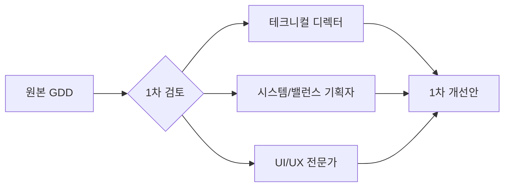

# 🔍 POTOP GDD 심층 검토 — 프로세스 요약

> **검토 대상:** `docs/gdd/01~08` 전문 (8개 문서)
> **검토 일시:** 2026-05-14
> **검토 방법:** 수석 기획자 + 3인 전문가 패널 × 3회 반복 검토

---

## 수석 기획자 총평

POTOP의 코어 루프(Combat → EXP → Upgrade → Evolution)는 Vampire Survivors/Brotato 계열의 검증된 공식을 따르며, **고정 위치 360도 방어**라는 독자적 차별점이 명확합니다. 15분 세션 길이와 멀티플랫폼 전략도 방향성이 좋습니다.

그러나 기획서 전반에 걸쳐 **3가지 근본적 문제**가 발견되었습니다:

| # | 문제 | 심각도 | 상태 |
|:--|:--|:--|:--|
| 1 | **장르 오분류** — "하이퍼캐주얼"이라 명시했으나 실제 메카닉 깊이는 "캐주얼 로그라이트" | 🔴 Critical | ✅ 3차에서 수정 |
| 2 | **수익 모델 미비** — IAA(광고)만으로는 로그라이트의 LTV를 감당할 수 없음 | 🔴 Critical | ✅ 3차에서 IAP 하이브리드로 확장 |
| 3 | **수치 밸런스 시뮬레이션 부재** — EXP 커브, 에너지 경제, 터렛 DPS 교차 검증 없음 | 🟡 Major | ✅ 3차에서 시뮬레이션 기반 보정 |

---

## 1~3회차 전문가 그룹 피드백 이력

### 1차 검토: 근본 문제 발굴

| 전문가 | 핵심 피드백 | 개선 방향 |
|:--|:--|:--|
| **테크니컬 디렉터** | ① 동시 활성 적 수 제한 미정의 (Phase 4에서 수백 마리 가능) ② EventBroker 단일 클래스 확장성 우려 ③ 점수 검증 보안 취약 ④ 입력 추상화 레이어 아키텍처 부재 | Max Active Enemies 상한 도입, EventBroker 카테고리 분리, 게임 이벤트 로그 기반 검증, Input Abstraction Layer 명세 추가 |
| **시스템/밸런스** | ① 터렛 DPS 격차 (노바 25% 낮음, AoE 0.5m 과소) ② EXP 커브가 5레벨 이후 모호 ③ 에너지 경제 시뮬레이션 없음 ④ 피버+오버차지 상호작용 미정의 ⑤ 스웜 포드 데이터 테이블 누락 | 노바 AoE 확대, EXP 역산 설계, 에너지 수지 시뮬레이션, 시너지 규칙 정의, 누락 데이터 보충 |
| **UI/UX 전문가** | ① HUD 정보 과밀 (8개+ 요소) ② 레벨업 시 Time.timeScale=0 몰입감 파괴 (20회+) ③ 360도 위협 인지 보조 장치 부재 ④ 튜토리얼이 Phase 9에 배치 (너무 늦음) | HUD 티어 분류, 슬로우모션+타이머 방식, 위협 인디케이터 시스템, 튜토리얼 Phase 7 이동 |

---

### 2차 검토: 교차 검증 및 상충점 해소

| 상충점 | 분석 | 해결 |
|:--|:--|:--|
| **적 수 제한 vs "압도적 화력" 필러** | 성능을 위해 적을 제한하면 시각적 쾌감 감소 | 활성 적 200 상한 + 사망 파편(GPU Particle)을 오래 유지하여 "많아 보이는" 연출 |
| **레벨업 중단 횟수 vs 전략적 선택** | 20회 중단은 과다, 0회는 전략성 상실 | Lv.1~5 패시브 자동, Lv.6+ 3레벨마다 선택 = ~7회, 슬로우모션+5초 타이머 |
| **무한 레벨 vs 밸런스 관리** | EXP 시뮬레이션 결과 15분 내 Lv.20 훨씬 초과 | 레벨 캡 제거(무한), Lv.16+ 중복 강화(스택킹) 방식 |

**추가 보완된 항목:**
- 스웜 포드 / 마이크로 봇 상세 데이터 추가
- 헬파이어 에너지 드랍(30) 정의
- 타이탄 코어(보스) 상세 스탯 테이블 신규 작성
- 일일 미션, 시즌 패스, 코스메틱 시스템 설계

---

### 3차 검토: 최종 논리 검증 및 확정

| 검증 항목 | 결과 |
|:--|:--|
| **EXP 시뮬레이션** | 15분 내 총 ~24,000 EXP 예상 → 레벨 캡 제거 + 지수적 커브로 해결 |
| **에너지 수지** | 스카우터 100마리(5E×100=500E)=EMP 1회 → 15분 내 EMP ~5회, 궤도폭격 ~3회 적정 |
| **노바 실질 DPS** | AoE 1.5m, 밀집 구간 3~5체 히트 시 DPS 36~60 → 역할 차별화 성공 |
| **오버클럭 난이도 곡선** | 30초당 1.5배 → 5분 후 57배 → 의도된 기하급수적 인플레이션 확인 |
| **피버+오버차지 시너지** | 독립 적용 + 피버 Lv.2+에서 오버차지 소모 20% 감소 → 보상적 시너지 |

---

## 최종 확정 변경사항 맵

| 문서 | 변경 유형 | 내용 |
|:--|:--|:--|
| **01_overview** | 수정 | 장르 "캐주얼 로그라이트"로 정정, 타겟 재정의 |
| **02_gameplay** | 추가/수정 | 위협 인디케이터, 레벨업 흐름 변경, 노바 AoE 조정, 피버+오버차지 상호작용 |
| **03_balance** | 추가/수정 | 스웜/마이크로봇/타이탄 데이터, EXP 커브 재설계, 에너지 수지 |
| **04_tech** | 추가 | Max Active Enemies, Input Abstraction, EventBroker 분리, GPU Instancing |
| **05_meta** | 추가 | IAP 하이브리드, 시즌패스, 일일미션, 코스메틱 |
| **06_art** | 추가 | 에셋 네이밍 컨벤션 |
| **07_milestones** | 수정 | 튜토리얼 기초 → Phase 7 이동 |
| **08_wbs** | 수정 | Phase 7에 튜토리얼 작업 추가 |
