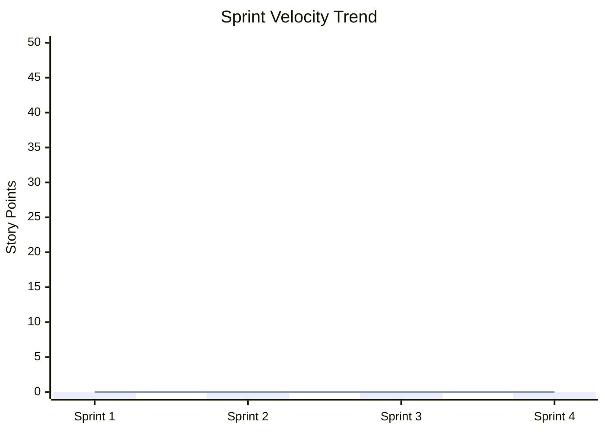

# Scrum — Sprint & Daily Progress

> **Project**: potop
> **Scrum Master**: {SCRUM_MASTER}
> **Product Owner**: {PRODUCT_OWNER}
> **Sprint Duration**: {1 week / 2 weeks}

---

## Quick Start

1. Sprint planning happens at the start of each sprint — fill Section 2
2. Daily standup logs go in Section 3 — one entry per day
3. Sprint review (Section 4) includes harness telemetry metrics
4. Retrospective (Section 5) produces actionable improvement items
5. The Definition of Done MUST align with harness mechanical DoD (coverage ≥ 80%, verified status)

---

## 1. Sprint Overview

### Current Sprint

| Attribute | Value |
|---|---|
| **Sprint Number** | {N} |
| **Sprint Goal** | {One sentence describing the sprint's primary objective} |
| **Start Date** | 2026-05-20 |
| **End Date** | 2026-05-20 |
| **Team Capacity** | {N story points / N hours} |
| **Committed Velocity** | {N story points} |

### Team Roster

| Member / Agent | Role | Availability | Focus Area |
|---|---|---|---|
| {Developer Name} | Developer | {100% / 80%} | {Backend / Frontend / Full-stack} |
| {antigravity} | AI Agent (Dev/QA) | Continuous | {Task execution via harness} |
| {jules} | AI Agent (PR) | 15 concurrent max | {Async PR generation} |
| {gemini_cli} | AI Agent (Script) | On-demand | {Quick scripting tasks} |

---

## 2. Sprint Planning

### 2.1 Sprint Backlog

| Task ID | User Story / Description | Priority | Size (SP) | Assignee | SRS Req | Status |
|---|---|---|---|---|---|---|
| {TASK-XXX} | {As a [user], I want [feature] so that [benefit]} | {P0} | {3} | {Agent/Dev} | {REQ-XXX-NNN} | {To Do / In Progress / Done} |
| {TASK-XXX} | {Description} | {P1} | {5} | {Agent/Dev} | {REQ-XXX-NNN} | {To Do} |

**Total Committed**: {N} story points

### 2.2 Sprint Capacity & Risk

| Risk | Probability | Impact | Mitigation |
|---|---|---|---|
| {Key developer unavailable} | {Low} | {High} | {Cross-train backup, delegate to AI agent} |
| {External API dependency delay} | {Medium} | {Medium} | {Use mock/stub, flag as blocked} |

---

## 3. Daily Standup Log

### Day {N} — 2026-05-20

| Member / Agent | Yesterday | Today | Blockers |
|---|---|---|---|
| {Name} | {What was completed} | {What will be worked on} | {None / Description} |
| {antigravity} | {TASK-XXX: GREEN phase verified, 87% coverage} | {TASK-YYY: RED phase — writing tests} | {None} |
| {jules} | {PR #42 opened for TASK-ZZZ} | {PR #43 for TASK-AAA} | {Merge conflict on shared module} |

**Standup Notes**: {Any decisions made, parking lot items}

---

### Day {N+1} — 2026-05-20

| Member / Agent | Yesterday | Today | Blockers |
|---|---|---|---|
| | | | |

---

## 4. Sprint Review

### 4.1 Delivery Summary

| Metric | Target | Actual | Delta |
|---|---|---|---|
| Story Points Completed | {N} | {N} | {+/-N} |
| Tasks Completed | {N} | {N} | {+/-N} |
| Tasks Carried Over | 0 | {N} | — |
| Bugs Found | — | {N} | — |

### 4.2 Harness Telemetry Summary

> Auto-populated from `harness.sh document --standard ISO_25010`

| Metric | Sprint Value | Trend (vs. Last Sprint) |
|---|---|---|
| **Avg Line Coverage** | {N}% | {↑/↓/→} |
| **Success Rate** | {N}% | {↑/↓/→} |
| **Avg Retry Count** | {N} | {↑/↓/→} (lower is better) |
| **Avg Task Duration** | {N}s | {↑/↓/→} (lower is better) |
| **Total Tokens Used** | {N} | {↑/↓/→} |

### 4.3 Task Detail

| Task ID | Title | Assignee | Status | Coverage | Retries | Duration | Notes |
|---|---|---|---|---|---|---|---|
| {TASK-XXX} | {Description} | {Agent/Dev} | {Verified/Approved} | {85%} | {1} | {45s} | {Completed successfully} |
| {TASK-YYY} | {Description} | {Agent/Dev} | {Failed→Carried Over} | {65%} | {3} | {120s} | {Coverage gap in edge cases} |

### 4.4 Demo Notes

| Feature | Demonstrated? | Stakeholder Feedback | Action Items |
|---|---|---|---|
| {Feature A} | Yes / No | {Positive / Needs revision} | {None / ADR needed} |

---

## 5. Sprint Retrospective

### 5.1 What Went Well

- {Item 1}
- {Item 2}

### 5.2 What Didn't Go Well

- {Item 1}
- {Item 2}

### 5.3 Action Items

| Action | Owner | Due Date | Status |
|---|---|---|---|
| {Improve test coverage for module X} | {Name} | 2026-05-20 | {To Do / Done} |
| {Reduce agent retry rate by improving prompt clarity} | {Name} | 2026-05-20 | {To Do} |

### 5.4 Process Metrics

| Metric | This Sprint | Last Sprint | Target |
|---|---|---|---|
| Velocity (SP) | {N} | {N} | {N} |
| Lead Time (avg) | {Nd} | {Nd} | {< Nd} |
| Cycle Time (avg) | {Nh} | {Nh} | {< Nh} |
| Escaped Defects | {N} | {N} | 0 |

---

## 6. Velocity Tracking (Historical)

| Sprint | Committed (SP) | Completed (SP) | Velocity | Avg Coverage | Avg Retries |
|---|---|---|---|---|---|
| Sprint 1 | {N} | {N} | {N} | {N}% | {N} |
| Sprint 2 | {N} | {N} | {N} | {N}% | {N} |

---

## 7. Definition of Done (Sprint-Level)

Aligned with Harness Protocol mechanical DoD:

- [ ] All committed user stories meet acceptance criteria
- [ ] Harness verification passed: status = `Verified` for all tasks
- [ ] Line coverage ≥ 80% for all GREEN tasks (LCOV validated)
- [ ] Cycle logs completed for all tasks
- [ ] ISO documentation synchronized (`harness.sh document`)
- [ ] No P0/P1 bugs remaining open
- [ ] Sprint review conducted with stakeholders
- [ ] Retrospective completed with action items assigned

---

## Related Documents

| Document | Path | Relationship |
|---|---|---|
| Kanban Board | `docs/agile/KANBAN.md` | Detailed task-level tracking |
| Task Registry | `docs/tasks/*.json` | Harness task state |
| Quality Metrics | `docs/quality_metrics.md` | Auto-generated by harness (ISO 25010) |
| Software Test Report | `docs/testing/STR.md` | Test execution results per sprint |
