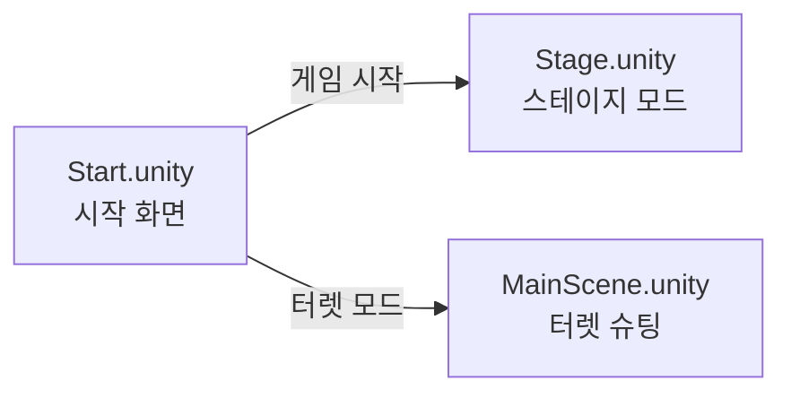
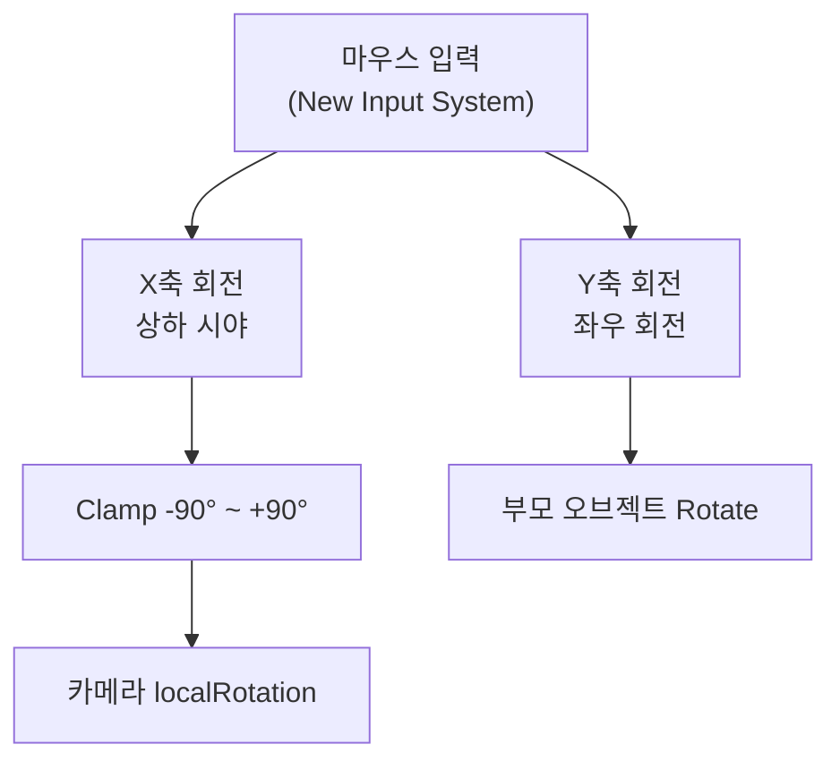
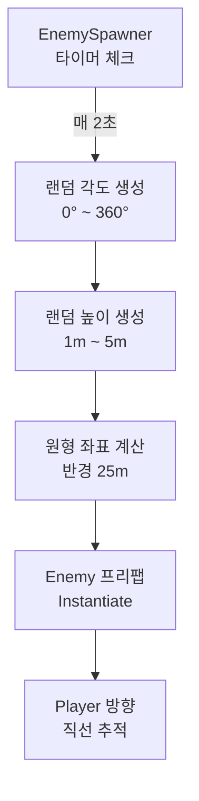
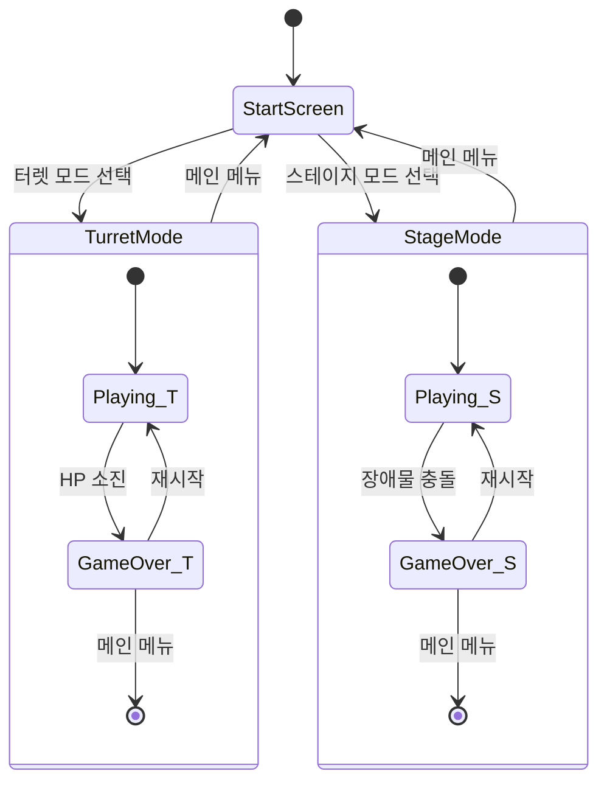

# 🎮 POTOP — 게임 기획서

> **문서 버전**: v1.1 (Phase 1 완료)  
> **최종 수정일**: 2026-04-24  
> **프로젝트 유형**: Unity 3D 게임 (클라이언트)  
> **엔진 버전**: Unity 6000.0.73f1

---

## 1. 프로젝트 개요

### 1.1 게임 컨셉

**POTOP**은 고정 위치에서 360도 전방위를 방어하는 **1인칭 터렛 디펜스 슈터**입니다.

플레이어는 고정된 포탑(터렛) 위에 위치하며, 마우스를 이용해 카메라를 자유롭게 회전시켜 사방에서 밀려오는 적들을 발사체(탄환)로 격파합니다. 간단한 조작과 긴장감 넘치는 전투가 핵심인 아케이드 스타일 게임입니다.

### 1.2 핵심 키워드

| 키워드 | 설명 |
|--------|------|
| **장르** | 1인칭 터렛 디펜스 / 아케이드 슈터 |
| **시점** | 1인칭 (FPS) — 고정 위치 |
| **조작** | 마우스 회전 + 클릭 사격 |
| **핵심 루프** | 탐색(회전) → 조준 → 사격 → 처치 → 반복 |
| **타깃 플랫폼** | PC (Standalone) |

### 1.3 한 줄 요약

> *"360도로 밀려오는 적을 터렛에서 쏘아 격파하라!"*

---

## 2. 기술 스택

### 2.1 엔진 및 환경

| 항목 | 세부 사항 |
|------|-----------|
| **게임 엔진** | Unity 6000.0.73f1 (Unity 6) |
| **렌더 파이프라인** | URP (Universal Render Pipeline) v17.4.0 |
| **입력 시스템** | New Input System v1.19.0 |
| **스크립팅 언어** | C# |
| **버전 관리** | Git (GitHub — `dragoncowkarma/potop`) |
| **에디터 연동** | Unity MCP, Rider / VS |

### 2.2 렌더링 설정

- **Quality Profiles**: PC용(`PC_RPAsset`) / Mobile용(`Mobile_RPAsset`) 이중 프로파일 구성
- **Color Space**: Linear
- **Post Processing**: URP Volume Profile 적용 (`DefaultVolumeProfile`, `SampleSceneProfile`)

---

## 3. 프로젝트 구조

### 3.1 디렉토리 구조

```
potop/
├── .git/
├── README.md
├── plan.md                          ← 기획서 (이 문서)
└── potop_client/                    ← Unity 프로젝트 루트
    ├── Assets/
    │   ├── Prefabs/                 ← 프리팹 에셋
    │   │   ├── Enemy.prefab         ← 적 오브젝트
    │   │   ├── Projectile.prefab    ← 발사체
    │   │   └── Sphere.prefab        ← 범용 오브젝트
    │   ├── Scenes/                  ← 게임 씬
    │   │   ├── Start.unity          ← 시작 화면 (메뉴 UI)
    │   │   ├── Stage.unity          ← 스테이지 모드 (HUD 포함)
    │   │   ├── MainScene.unity      ← 터렛 슈팅 모드 (HUD 포함)
    │   │   └── SampleScene.unity    ← 기본 샘플
    │   ├── Scripts/                 ← C# 스크립트
    │   │   ├── Core/               ← 핵심 시스템 (Phase 1 신규)
    │   │   │   ├── GameManager.cs   ← 게임 상태 관리 (HP, 점수, 게임오버)
    │   │   │   └── GameHUD.cs       ← HUD UI 매니저
    │   │   ├── _Main/              ← 씬 매니저 스크립트
    │   │   │   ├── StartMain.cs     ← 시작 씬 컨트롤러 + 씬 전환
    │   │   │   └── StageMain.cs     ← 스테이지 씬 컨트롤러 + 난이도 상승
    │   │   ├── Stage/              ← 스테이지 관련 스크립트
    │   │   │   ├── Player.cs        ← 플레이어 카메라 조작
    │   │   │   └── Obstacle.cs      ← 낙하 장애물 + 데미지
    │   │   ├── Enemy.cs             ← 적 AI (추적 + 데미지)
    │   │   ├── EnemySpawner.cs      ← 적 스폰 시스템
    │   │   ├── FirstPersonLook.cs   ← 1인칭 시점 카메라
    │   │   ├── Projectile.cs        ← 발사체 물리/충돌 + 점수
    │   │   └── TurretShooter.cs     ← 터렛 사격 시스템
    │   └── Settings/               ← URP 렌더 설정
    ├── Packages/
    └── ProjectSettings/
```

### 3.2 씬 구성



| 씬 | 역할 | 주요 스크립트 |
|----|------|--------------|
| `Start.unity` | 게임 시작 화면 / 메뉴 | `StartMain.cs` |
| `Stage.unity` | 장애물 회피 스테이지 | `StageMain.cs`, `Player.cs`, `Obstacle.cs` |
| `MainScene.unity` | 터렛 디펜스 슈팅 | `FirstPersonLook.cs`, `TurretShooter.cs`, `EnemySpawner.cs`, `Enemy.cs`, `Projectile.cs` |

---

## 4. 핵심 시스템 설계

### 4.1 게임 모드 ① — 터렛 디펜스 (MainScene)

플레이어가 고정된 터렛에서 360도 사방으로 밀려오는 적을 사격하는 핵심 게임 모드입니다.

#### 카메라 시스템 (`FirstPersonLook.cs`)



- **감도**: `mouseSensitivity = 200f`
- **상하 제한**: -90° ~ +90° (천장/바닥 제한)
- **좌우 회전**: 360도 무제한 회전
- **커서**: 게임 시작 시 잠금 + 숨김

#### 사격 시스템 (`TurretShooter.cs`)

| 파라미터 | 값 | 설명 |
|----------|-----|------|
| `fireRate` | 0.5초 | 연사 간격 |
| 입력 | 마우스 좌클릭 | `Mouse.current.leftButton.wasPressedThisFrame` |
| 발사 위치 | 카메라 위치 | `transform.position` |
| 발사 방향 | 카메라 정면 | `transform.rotation` |

- **크로스헤어**: Canvas 기반 TextMeshPro `+` 표시 (Phase 1에서 OnGUI → Canvas 전환)

#### 발사체 시스템 (`Projectile.cs`)

| 파라미터 | 값 | 설명 |
|----------|-----|------|
| `speed` | 50 | 발사체 속도 (m/s) |
| `lifeTime` | 3초 | 자동 소멸 시간 |
| 충돌 판정 | `OnCollisionEnter` | "Enemy" 태그 적 파괴 |

- Rigidbody 기반 물리 이동 (`rb.linearVelocity`)
- 적과 충돌 시 적 + 탄환 동시 파괴

#### 적 시스템 (`Enemy.cs` + `EnemySpawner.cs`)

**적 AI:**
- `GameObject.Find("Player")`로 타깃 탐색
- 매 프레임 플레이어 방향으로 직선 이동
- 기본 속도: `10 m/s`

**스폰 시스템:**
- 스폰 주기: `2초` 간격
- 스폰 반경: `25m` 원형 영역
- 스폰 높이: `1m ~ 5m` 랜덤
- 360도 전 방위 랜덤 스폰 (각도 기반)



---

### 4.2 게임 모드 ② — 스테이지 모드 (Stage)

낙하하는 장애물을 회피하는 서바이벌 모드입니다.

#### 스테이지 매니저 (`StageMain.cs`)

- **싱글톤 패턴**: `StageMain.main` 정적 인스턴스
- **장애물 스폰**: 3~5초 랜덤 간격으로 상공(y=10)에서 장애물 낙하
- **스폰 범위**: 반경 10m 원형 영역, 360도 랜덤
- **커서**: 잠금 상태

#### 플레이어 (`Player.cs`)

- 마우스 기반 1인칭 카메라 회전
- `Camera.main`을 직접 회전 조작
- 감도: `200f`
- 상하 제한: -90° ~ +90°

> [!NOTE]
> **버그 수정 완료 ✅**: `Player.cs` 20행의 `mouseY` 계산 버그 (`delta.x` → `delta.y`) 수정 완료

#### 장애물 (`Obstacle.cs`)

- Rigidbody 기반 물리 오브젝트
- 매 프레임 원점(0,0,0) 방향으로 힘 적용 → 중앙 수렴 효과

---

## 5. 현재 구현 현황

### 5.1 Phase 1 완료 항목 ✅

| 기능 | 상태 | 파일 |
|------|------|------|
| 1인칭 마우스 룩 | ✅ 완료 | `FirstPersonLook.cs`, `Player.cs` |
| 터렛 발사 (마우스 좌클릭) | ✅ 완료 | `TurretShooter.cs` |
| 발사체 물리 이동 & 충돌 + 점수 | ✅ 완료 | `Projectile.cs` |
| 적 스폰 시스템 (360도) | ✅ 완료 | `EnemySpawner.cs` |
| 적 AI (추적 + 데미지) | ✅ 완료 | `Enemy.cs` |
| 장애물 스폰 + 점진적 난이도 | ✅ 완료 | `StageMain.cs` |
| 장애물 물리 + 데미지 | ✅ 완료 | `Obstacle.cs` |
| 씬 구성 (Start/Stage/Main) | ✅ 완료 | 3개 씬 |
| New Input System 적용 | ✅ 완료 | 전체 |
| URP 렌더링 파이프라인 | ✅ 완료 | Settings 에셋 |
| **시작 화면 UI + 씬 전환** | ✅ **Phase 1** | `StartMain.cs` |
| **GameManager (HP/점수/게임오버)** | ✅ **Phase 1** | `GameManager.cs` |
| **HUD UI (HP바/점수/크로스헤어)** | ✅ **Phase 1** | `GameHUD.cs` |
| **게임 오버 + 재시작/메인메뉴** | ✅ **Phase 1** | `GameHUD.cs` |
| **Player.cs 버그 수정** | ✅ **Phase 1** | `Player.cs` |
| **게임오버 시 입력 차단** | ✅ **Phase 1** | `FirstPersonLook.cs`, `TurretShooter.cs` |

### 5.2 미구현 / 다음 단계 항목 🔲

| 기능 | 우선순위 | 설명 |
|------|----------|------|
| 웨이브 시스템 | 🟡 중간 | 시간 경과에 따른 난이도 증가 (스폰 속도, 적 속도) |
| 적 다양화 | 🟡 중간 | 다양한 적 타입 (빠른 적, 탱크 적, 비행 적) |
| 무기 업그레이드 | 🟡 중간 | 연사 속도, 데미지, 다중 발사 등 |
| 사운드 시스템 | 🟡 중간 | 사격음, 피격음, BGM |
| VFX / 이펙트 | 🟡 중간 | 발사 이펙트, 폭발 이펙트, 피격 이펙트 |
| 오브젝트 풀링 | 🟢 낮음 | Instantiate/Destroy 대신 풀링으로 성능 최적화 |
| 리더보드 | 🟢 낮음 | 최고 점수 로컬 저장 |

---

## 6. 향후 개발 로드맵

### Phase 1 — 핵심 게임 루프 완성 (MVP) ✅ 완료

> 목표: **플레이 가능한 최소 제품** — **2026-04-24 구현 완료**

**완료된 작업:**
1. ✅ `GameManager.cs` — 싱글톤 게임 상태 관리 (HP, 점수, 이벤트 시스템, 게임오버)
2. ✅ `GameHUD.cs` — Canvas 기반 HUD (HP바, 점수, 크로스헤어, 게임오버 패널)
3. ✅ `StartMain.cs` — 시작 화면 UI (터렛 모드 / 스테이지 모드 / 종료 버튼 + 씬 전환)
4. ✅ `Enemy.cs` — 플레이어 도달 시 데미지 + scoreValue
5. ✅ `Projectile.cs` — 적 처치 시 점수 연동
6. ✅ `TurretShooter.cs` — OnGUI 제거, 게임오버 시 사격 차단
7. ✅ `FirstPersonLook.cs` — 게임오버 시 카메라 입력 차단
8. ✅ `StageMain.cs` — 생존 시간 점수 + 점진적 난이도 상승
9. ✅ `Obstacle.cs` — Player 충돌 시 데미지
10. ✅ `Player.cs` — mouseY 버그 수정
11. ✅ 빌드 설정 — Start / MainScene / Stage 3개 씬 등록
12. ✅ 모든 씬 UI 구성 완료 (MainScene, Start, Stage)

---

### Phase 2 — 게임 확장

> 목표: **컨텐츠 다양화 및 리플레이 가치 향상**

- ⚔️ **웨이브 시스템**: 시간 기반 난이도 증가
- 👾 **적 다양화**: 3~5종 적 타입 추가
- 🔫 **무기 시스템**: 무기 교체 / 업그레이드
- 💰 **인게임 상점**: 처치 보상으로 업그레이드 구매
- 🎵 **사운드 & VFX**: 몰입감 증대

---

### Phase 3 — 폴리싱

> 목표: **출시 수준 완성도**

- 🎨 **환경 아트**: 맵 디자인 및 배경 오브젝트
- ✨ **파티클 이펙트**: 발사, 폭발, 피격, 환경
- 📊 **리더보드**: 로컬 최고 기록 시스템
- ⚡ **최적화**: 오브젝트 풀링, LOD, 배칭
- 🎮 **게임패드 지원**: 컨트롤러 입력 대응
- 📱 **크로스 플랫폼**: Mobile 빌드 검증

---

## 7. 기술적 고려 사항

### 7.1 알려진 이슈

> [!NOTE]
> **`Player.cs` 버그** — ✅ 수정 완료 (2026-04-24). `mouseY` 계산 시 `delta.x` → `delta.y`로 변경.

> [!WARNING]
> **성능 고려** — `Enemy.cs`에서 `GameObject.Find("Player")`를 `Start()`에서 호출 중. 대량 스폰 시 매 프레임이 아닌 `Start()`에서만 호출하므로 현재는 문제없으나, 향후 참조 캐싱 또는 이벤트 기반 시스템으로 전환 권장.

> [!NOTE]
> **오브젝트 풀링 미적용** — 현재 `Instantiate` / `Destroy` 패턴 사용 중. 대량 적 스폰 시 GC 스파이크 가능성. Phase 3에서 풀링 시스템 도입 예정.

### 7.2 아키텍처 개선 방향

| 현재 | 개선 방향 |
|------|-----------|
| 스크립트 간 직접 참조 | 이벤트 시스템 / ScriptableObject 기반 통신 |
| `GameObject.Find()` | 인스펙터 직접 참조 또는 싱글톤 매니저 |
| `OnGUI()` 크로스헤어 | UI Toolkit 또는 Canvas 기반 UI |
| Instantiate/Destroy | 오브젝트 풀링 패턴 |
| 하드코딩된 수치 | ScriptableObject 데이터 에셋 |

---

## 8. 게임 플로우



---

## 9. 리소스 에셋 현황

### 프리팹

| 프리팹 | 용도 | 비고 |
|--------|------|------|
| `Enemy.prefab` | 적 오브젝트 | "Enemy" 태그 필요 |
| `Projectile.prefab` | 발사체 | Rigidbody 포함 |
| `Sphere.prefab` | 범용 구체 | 장애물 / 테스트용 |

### Input Actions

- `InputSystem_Actions.inputactions` — Unity New Input System 액션 맵 (기본 템플릿)

---

## 10. 요약

**POTOP**은 Unity 6 + URP 기반의 1인칭 터렛 디펜스 게임으로, 두 가지 게임 모드(터렛 슈팅 / 장애물 회피)를 제공합니다. **Phase 1 MVP가 완료**되어 시작 화면 → 게임 플레이 → 게임 오버 → 재시작/메인메뉴의 전체 게임 루프가 작동합니다. 다음 목표는 Phase 2 게임 확장(웨이브, 적 다양화, 무기 시스템)입니다.

---

*이 문서는 `potop_client` 프로젝트의 실제 코드 분석을 기반으로 자동 생성되었습니다. (v1.1 — Phase 1 완료 반영)*
